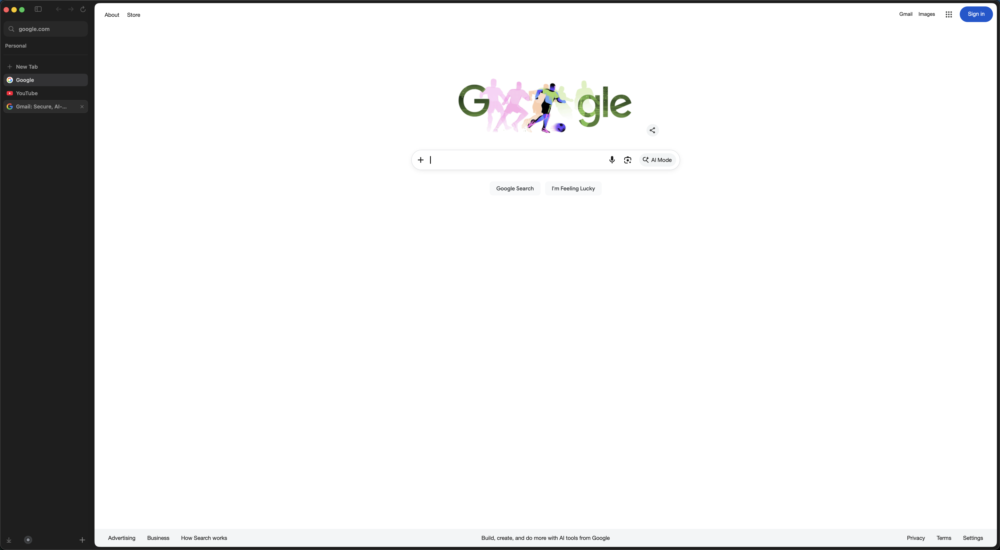

# Candoa

Feel superhuman in the browser.

Candoa is a native-feeling browser workspace for macOS. It keeps projects,
tabs, and quick actions close together so everyday web work feels calmer,
faster, and easier to return to.

[Download Candoa](https://candoa.app/downloads/Candoa.dmg) ·
[Visit candoa.app](https://candoa.app) ·
[Browser app repository](https://github.com/aamancio/candoa)



## Why Candoa

Modern work happens in the browser, but the browser still treats everything
like one long pile of tabs. Candoa gives your web work a place to live.

- Spaces keep projects, writing, research, and everyday browsing separated.
- Vertical tabs make busy sessions easier to scan.
- Quick actions help you open, switch, pin, close, and copy without breaking
  flow.
- A local-first Mac experience keeps the workspace focused on your work, not
  another feed.

## Built For

Candoa is for people who live in the browser: builders, researchers, writers,
students, and anyone who moves between tabs all day.

It is still early, but the goal is clear: a calmer, more capable browser for
Mac productivity.

## Download

The public macOS download is always:

```text
https://candoa.app/downloads/Candoa.dmg
```

Open the DMG, drag Candoa into Applications, then launch it from Applications.

## For Maintainers

This repository contains the marketing site for Candoa. The macOS app lives in
[`aamancio/candoa`](https://github.com/aamancio/candoa).

The site is deployed on Vercel at:

- [candoa.app](https://candoa.app)
- [www.candoa.app](https://www.candoa.app)
- [candoa.vercel.app](https://candoa.vercel.app)

App builds are owned by the browser repository. Its GitHub Actions workflow can
publish the latest drag-to-Applications DMG into this repository at:

```text
public/downloads/Candoa.dmg
```

Keep the public download link pointed at `/downloads/Candoa.dmg`. Versioned DMG
archives can also live in `public/downloads/` for internal handoff. Sparkle
updates use `public/downloads/appcast.xml`, and the site reads the displayed app
version from `public/downloads/latest.json`.

Local development:

```sh
pnpm install
pnpm dev
```

Useful checks:

```sh
pnpm lint
pnpm build
```
